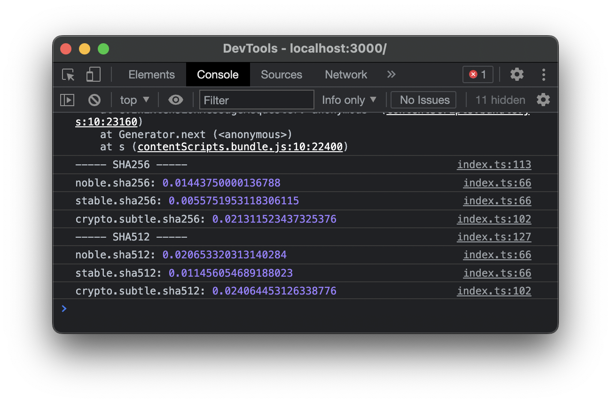
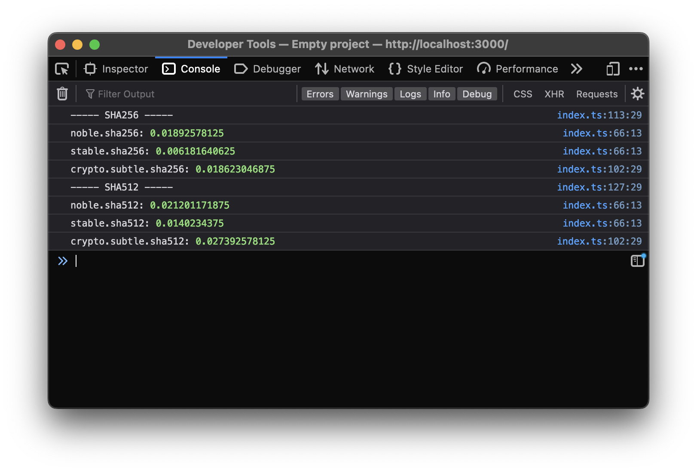
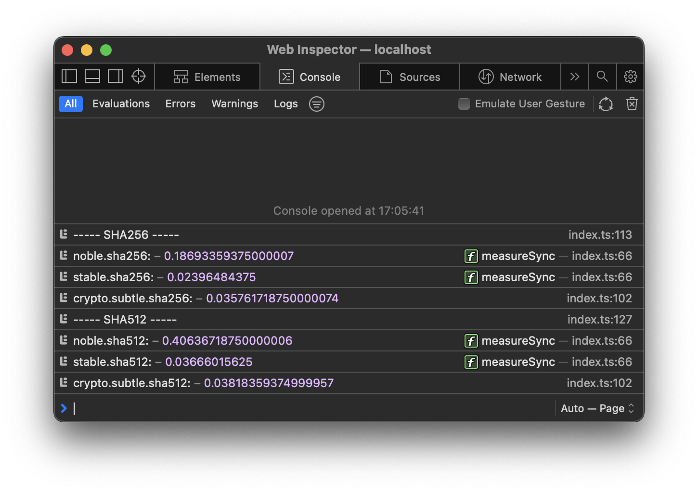

# Dummy benchmark for SHA256 and SHA512 hashing in browser

Contenders:

- [noble-hashes](https://github.com/paulmillr/noble-hashes)
- [@stablelib/sha256](https://www.stablelib.com/modules/_stablelib_sha256.html) and [@stablelib/sha512](https://www.stablelib.com/modules/_stablelib_sha512.html)
- Native browser [crypto.subtle.digest](https://developer.mozilla.org/en-US/docs/Web/API/SubtleCrypto/digest)

# Results

Tested on Mac OS Monterey, Apple M1 Max chip.

Chrome 105.0.5195.125:



Firefox 105.0.1:



Safari 16.0 (17614.1.25.9.10, 17614):



# Measuring on your own

```sh
pnpm install && pnpm run start:browser
```

Then open `http://localhost:3000` in browser and see benchmark results in the browser console.

To run same (`crypto.subtle` repalced with native Node.js `crypto` module) benchmark on Node.js:

```sh
pnpm install && pnpm run start:browser
```

## Credits

Made with [createapp.dev](https://createapp.dev/)
